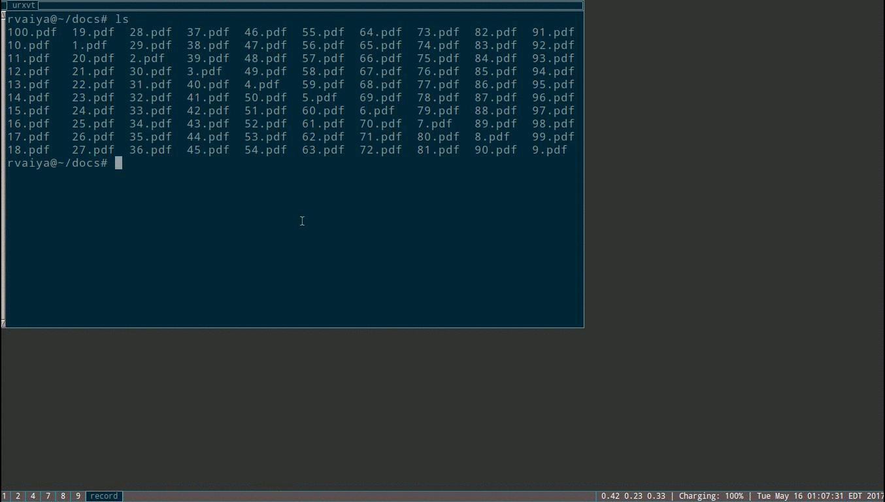

# Description

A small X11 program which produces a menu based on line separated
records and prints the selected option to STDOUT.

Demo:



# Installation

```
make
sudo make install
```
  
# Usage

xmenu was primarily written as a way to interact with transiently
executing scripts of the kind that are commonly found in the
environments of users of minimalist window managers.

E.G

```
ps aux|grep urxvt|xmenu|awk '{ print $2 }'|xargs kill
```

might be bound to a button which allows the user to selectively
kill a terminal instance.

# Customization

The appearance of the menu can be configured in ~/.xmenurc.  xmenu -h
will produce a description of each option, though most should be
self explanatory. A good way to start is

```
xmenu -c > ~/.xmenurc
```

which will populate .xmenurc with default options that can then be
tweaked in accordance with the user's preference.

## Keybindings

 Keybindings can be customized in ~/.xmenurc. The stock keybindings
 are vi-like (hjkl, H, L, C-f, /, etc) and support count operands ('4H'
 places the cursor on the fourth visible item).
 
# Dependencies

- libxcb
- Xft
- Xlib-xcb
- Xlib

# Bugs/Feature Requests

Feel free to email r.vaiya@gmail.com with bugs or feature requests.